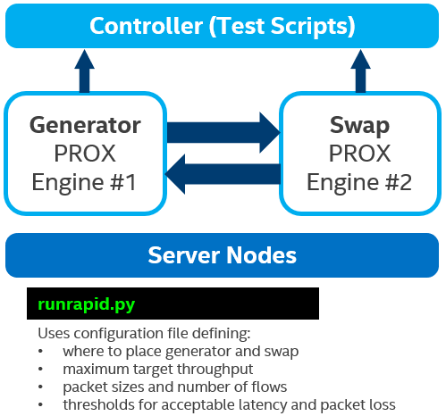

# rapid PROX

## Objective

Open-source toolset for automated peak traffic (saturation) throughput testing, characterizing containerized NFVI performance.

Used during development to validate whether a containerized NFVI meets required packet processing rates within defined packet drop and latency percentile bounds.

Comprises two components:

- PROX (Packet Processing eXecution) – DPDK-based engine for highly configurable packet operations and performance statistics.
- Rapid – Automation scripts.

PROX is typically packaged as a container per this guide, but can also run in a non‑containerized GuestOS VM.

## Test framework

The diagram below describes the design and operation of the automated test framework software. On the desired server nodes, we instantiate two PROX engines.

The control script performs the following tasks:

- Configures one engine as the Generator and the other as Swap.
- Starts the test at the target maximum throughput level.
- Uses binary search to find a peak traffic (saturation) throughput rate that is within acceptable latency and packet loss rates.
- Presents the final results on screen.
- Sends the results as metrics to Prometheus Pushgateway.



It is also possible to create other configurations with multiple Generators, Swaps, Impair Gateways or other desired behaviors.

## Build

Prerequisites: bash, Docker Engine.

Build image with

```
cd rapid/docker
./build.sh
```

which will build Ubuntu-based container image with PROX, and Python:slim-based image with Rapid.

Optionally modify [config](./config) file with your image repository or image names to be used.

Optionally start local Docker Registry, or modify [push.sh](./build/push.sh) to authenticate to your image repository.

Push image to repository with

```
./push.sh
```

## Start test

Prerequisites: kubectl, properly configured Telco Cloud k8s cluster where DPDK-based dataplane applications can work.

Create prox namespace with
```
cd k8s
kubectl apply -f 0-ns.yaml
```

Note that applying current [k8s/5-controller.yaml](./k8s/5-controller.yaml) will automatically do the example test run which is Layer 2, 64B packets, zero packet loss, 99% latency percentile. If you don't want to automatically do the test run, then change [```command```](https://github.com/petorre/rapidPROX/blob/ad95e938343e7b050ba2558731bbc27640f92b3d/k8s/5-controller.yaml#L15) to ```sleep infinity```, apply it, then in later step connect into controller pod to run the same command ```runrapid.py```.

Create test pods and services, and do the test run with
```
kubectl apply -f 1-ip-cm.yaml -f 2-swap.yaml -f 3-gen.yaml -f 4-pushgateway.yaml -f 5-controller.yaml
```

You can observe how it runs with

```
kubectl logs -f -n prox controller
```

which will show something like

```
Using 'rapid.env' as name for the environment
Using 'tests/l2zeroloss.test' for test case definition
Using 'machine.map' for machine mapping
Runtime: 1
Latency percentile at 99%
Checking DPDK version for POD Generator
Checking assigned SRIOV VF for POD Generator
Getting MAC address for assigned SRIOV VF 0000:29:00.0
Checking DPDK version for POD Swap
Checking assigned SRIOV VF for POD Swap
Getting MAC address for assigned SRIOV VF 0000:28:00.0
HTTP copying from parameters-gen-9090.lua to gen:/opt/rapid/parameters.lua
HTTP copying from parameters-swap-9090.lua to swap:/opt/rapid/parameters.lua
HTTP copying from helper.lua to gen:/opt/rapid/helper.lua
HTTP copying from configs/l2gen.cfg to gen:/opt/rapid/l2gen.cfg
HTTP copying from helper.lua to swap:/opt/rapid/helper.lua
HTTP copying from configs/l2swap.cfg to swap:/opt/rapid/l2swap.cfg
Connected to PROX on swap
Connected to PROX on gen
flowsizetest
Warming up during 2 seconds..., packet size = [64], flows = 512, speed = 1.0
+--------------------------------------------------------------------------------------------------------------------------------------------------------------------------------------------------------+
| UDP,    64 bytes, different number of flows by randomizing SRC & DST UDP port.                                                                                                                         |
+--------+------------------+-------------+-------------+-------------+------------------------+----------+----------+----------+-----------+-----------+-----------+-----------+-------+-----------+----+
| Flows  | Speed requested  | Gen by core | Sent by NIC | Fwrd by SUT | Rec. by core           | Avg. Lat.|99 Pcentil| Max. Lat.|   Sent    |  Received |    Lost   | Total Lost|L.Ratio|Mis-ordered|Time|
+--------+------------------+-------------+-------------+-------------+------------------------+----------+----------+----------+-----------+-----------+-----------+-----------+-------+-----------+----+
|    512 |  1.7%  0.256 Mpps|  0.256 Mpps |  0.256 Mpps |  0.256 Mpps | 0.2 Gb/s |  0.255 Mpps |      0 us|>   97 us |     0 us |    852500 |    852500 |         0 |         0 |  0.00 |     5881  |  2 |
+--------+------------------+-------------+-------------+-------------+------------------------+----------+----------+----------+-----------+-----------+-----------+-----------+-------+-----------+----+
HTTP copying from gen:/opt/rapid/prox.log to ./Generator.prox.log
HTTP copying from swap:/opt/rapid/prox.log to ./Swap.prox.log
HTTP copying from gen:/opt/rapid/prox.log to ./Generator.prox.log
HTTP copying from swap:/opt/rapid/prox.log to ./Swap.prox.log
```

where Mpps result will depend on your worker node setup.

Those results are also sent to Pushgateway from where you can read them with

```
curl -s "http://$( kubectl get svc pushgateway -n prox -o jsonpath='{.spec.clusterIP}:{.spec.ports[0].port}' )/metrics" | grep rapid | grep -v push
```

which will give something like

```
CPUPower{instance="",job="rapid"} 0
Flows{instance="",job="rapid"} 512
Lost{instance="",job="rapid"} 0
PCTLatency{instance="",job="rapid"} 97.09037037037037
RAMPower{instance="",job="rapid"} 0
RevByCore{instance="",job="rapid"} 0.25564747826303735
Sent{instance="",job="rapid"} 852527
Size{instance="",job="rapid"} 64
SystemPower{instance="",job="rapid"} 0
Total{instance="",job="rapid"} 171.79510539276112
```

of which ```RevByCore``` is the Mpps result.

## Clean

Delete whole namespace with

```
cd k8s
kubectl delete -f 0-ns.yaml
```

## CI-published images and Helm chart

`prox` and `rapid` images are automatically built and published to GitHub Container Registry on every push to `master` (and on version tags), see [.github/workflows/docker-publish.yml](./.github/workflows/docker-publish.yml):

```
ghcr.io/<owner>/prox:latest
ghcr.io/<owner>/rapid:latest
```

A Helm chart at [charts/prox/](./charts/prox/) deploys a configurable-size StatefulSet of `prox` pods on a dedicated Multus network (SR-IOV or PCI passthrough, VLAN and IPAM configurable), plus a `rapid` controller pod already wired up to drive a throughput test between them — see [charts/prox/README.md](./charts/prox/README.md). It's published as an OCI artifact by [.github/workflows/helm-publish.yml](./.github/workflows/helm-publish.yml):

```
helm install prox oci://ghcr.io/<owner>/charts/prox --version <version> -n prox --create-namespace
```

## Validated OS, k8s distribution and server/VM

Ubuntu 24.04.4 LTS, k3s v1.34.6+k3s1, AWS EC2 c8i.2xlarge (with two added vNICs used as DPDK interfaces, host-device plugin, NAD and [k8s/host-device/](./k8s/host-device/)).
